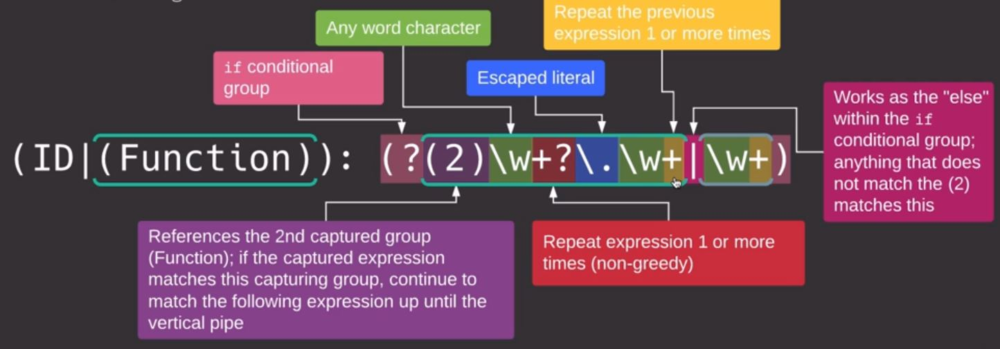

# Regex Intro

Def: generalize a pattern, search and match that pattern

## Where to use Regex:

* Programming:
    - Python
    - perl
    - ...
* Text processing:
    - awk
    - sed
* other applications

## Where to test them:

* [regexr](https://regexr.com/)
* [regex101](https://regex101.com/)
* [regexpal](https://www.regexpal.com/)
* ...

## Regex engines

Regex are based on 2 algorithmes:
    - NFA: Non deterministic Finite automaton
    - DFA: deterministic Finite automaton

* NFA based engines( can go back in the regex):
    - Python
    - Vim
    - sed
    - ...

* DFA based engine (cannot go back):
    - grep
    - awk

-> Newer versions of `grep` and `awk` use both.

## Regex standards

IEEE POSIX standards: DFA friendly, implements three standards:
    - BRE
    - ERE
    - SRE
  * ERE builds off BRE

PCRE Standards: Perl Compatible Regex Expressions:
  * used by other standards such as Java, python, .net .
  * There is some differences between Perl active implementation and PCRE
  * NFA minded

# Regex

## Matching word and caracters

`[ABD]`: match these three capital caracters.

`[A-D]`: match the range of caracters from A to D

`\W`   : Match a non word caracter ( not A-Z, a-z, 0-9).

`\w`   : Match a word Caracter (A-Z, a-z, 0-9), each instance of \w is a single caracter.

`\D`   : Match a non digit caracter

`\d`   : Match a single digit caracter.

`[5-9]`: Match a range of numbers( from 5 to 9 )

`\s`   : Match a whitespace

`\s\s+`: Match any kind of whitespace (tab, carriage return, ...)

`+`    : Repeat the previous token one or more times

`\t`   : A hard tab

`^`    : Beginning of a line

`$`    : End of a line

`\b`   : Word boundery: (opening and closing will make sure the word in between won't be followed/started by a word)

`\B`   : Word bondery: (sma thing but it is the opposite of `\b`)

`()`   : Define a group

`|`    : Define alteration (or)

`?`    : make the last caraceter optional

`*`    : repeat the previous caracter 1 or more times

`.`    : wild card that much any caracter

`()`   : Matching group.

## look ahead

* Allow to precise what should come after our regex.

`(?=)` : Match an expresion in a group but do not capture it. (works as a boundary).
`?=`   : Tells the matching group we want to match a look ahead
`?!`   : Negative look ahead. (make sure if matches anything but the provided expression)

## look behind

`(?<=)` : Match an expresion in a group but do not capture it. (works as a boundary).
`?<=`   : Tells the matching group we want to match a look behind
`?<!`   : Negative look behind. (make sure if matches anything but the provided expression)

Note: we need to make sure the look behind is with a static length or it will not work

## Conditionals

We can sue conditonals with if else or even nested conditionals.(too complicated to use for me though)

# sed

`-i`   : Edit and replace the file.

`-r`   : Use extended regular expressions.

